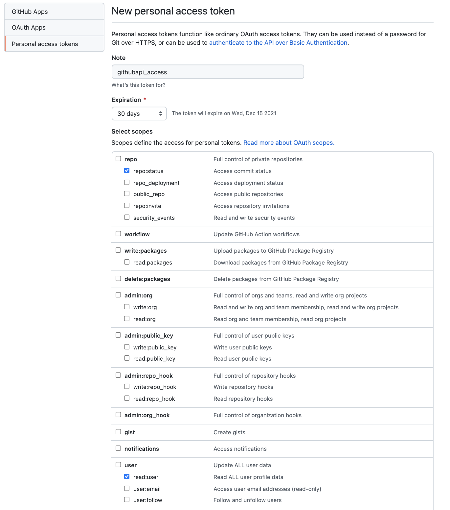

# gh-contrib

To retrieve github contributions org wise or repo wise in a org and display in a tabular format (markdown)

## Pre-requistes

- Have a [gihub personal access token](https://docs.github.com/en/authentication/keeping-your-account-and-data-secure/creating-a-personal-access-token) which has permission to read repo status and user info. Takecare not to share token with anyone else since it works same as password :)

  

## Note

Since github api is [rate limited](https://docs.github.com/en/rest/overview/resources-in-the-rest-api#rate-limiting) application might take longer to execute. I am yet to handle the rate limiting inside code to keep it waiting.

## Features

- [x] Count contributions org wise
- [x] Count contributions repository wise in a org
- [x] Generates file output to share

## Usage

### Contributions to a org

```go
Usage: gh-contrib contrib-org --token=STRING --org=STRING --author=STRING

Github contributions of a user in a org.

Flags:
  -h, --help             Show context-sensitive help.
      --token=STRING     GitHub API token.
      --output-file      Set to true if output file need to be generated.

      --org=STRING       GitHub Org.
      --author=STRING    Author.
```

### Contributions to a repo in an org

```go
Usage: gh-contrib contrib-repo --token=STRING --org=STRING --repo=STRING --author=STRING

Github contributions of a user to a repo of a org.

Flags:
  -h, --help             Show context-sensitive help.
      --token=STRING     GitHub API token.
      --output-file      Set to true if output file need to be generated.

      --org=STRING       GitHub Org.
      --repo=STRING      GitHub Repo in particular to check contributions.
      --author=STRING    Author.
```

## Installation

### Build and Install Binary

```bash
git clone https://github.com/slashpai/gh-contrib.git
make build
```

Execute binary

```go
./gh-contrib help
```

or you can move it path like `/usr/local/bin` and execute simply `gh-contrib`

It should display output like below

```go
Usage: gh-contrib --token=STRING <command>

Count your github contributions from command line

Flags:
  -h, --help            Show context-sensitive help.
      --token=STRING    GitHub API token.
      --output-file     Set to true if output file need to be generated.

Commands:
  contrib-org     Github contributions of a user in a org.
  contrib-repo    Github contributions of a user to a repo of a org.

Run "gh-contrib <command> --help" for more information on a command.
```

**Example Run**

To get contribution org wise

```go
gh-contrib contrib-org --token <token> --org <org name> --author <github handle>
```

To get contribution repo wise in an org

```go
gh-contrib contrib-repo --token <token> --org <org name> --author <github handle>
```

To generate output file, add flag --output-file to command

```go
gh-contrib contrib-org --token <token> --org <org name> --author <github handle> --output-file
```

### Build docker image locally

```bash
make build-local-image
```

Execute as docker container

Test running container. It should display help menu

```go
docker run gh-contrib:v0.1.0
```

Run container to get org level contributions

```go
docker run gh-contrib:v0.1.0 contrib-org --token <token> --org <org name> --author <github handle>
```

To generate output file, add flag --output-file to command

```go
docker run -v output_files:/opt/app gh-contrib:v0.1.0 contrib-org --token <token> --org <org name> --author <author name> --output-file
```

You will require to volume path to view the file, this will be a bit different in [mac](https://timonweb.com/docker/getting-path-and-accessing-persistent-volumes-in-docker-for-mac/) but should be straight forward in linux.

## Sample Output

- [sample output](sample_output/sample_output_contrib-repo.md)

## TODO

- [ ] Add more logging info and created debugging mode
- [ ] General Improvement & Optimisation
- [ ] Add parallelism to code
- [ ] Option to count contributions without specifying org
- [ ] Add web output
- [ ] Create executable to easily install the application
- [ ] Handle rate-limiting which will be an issue for large org's

## Contributing

- Bug reports and pull requests are welcome

  - Fork the project on GitHub
  - Clone the project
  - Add changes (and tests if applicable)
  - Commit and push
  - Create a pull request

## License

[MIT](LICENSE)
